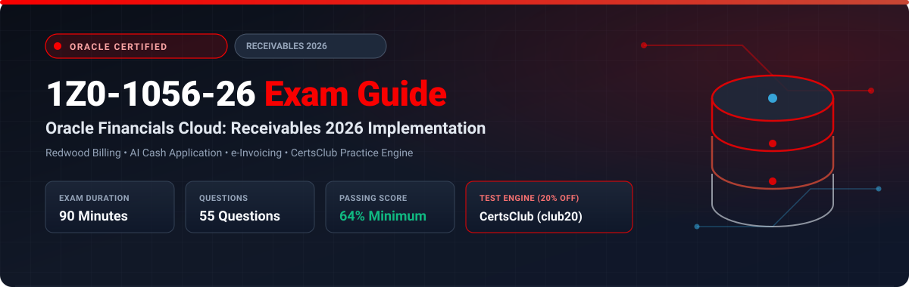

  

# Oracle Financials Cloud: Receivables 2026 Implementation Professional (1Z0-1056-26) Exam Study Guide & Practice Test Resource Portal

[-f80000?style=for-the-badge&logo=oracle&logoColor=white)](https://education.oracle.com/)

[-28a745?style=for-the-badge&logo=shield)](https://www.certsclub.com/oracle/)

---

## 1. Exam Overview & Candidate Profile

The **Oracle Financials Cloud: Receivables 2026 Implementation Professional (1Z0-1056-26)** exam validates that an implementation consultant possesses the modern skills needed to deploy Oracle Fusion Cloud Receivables in modern enterprise environments. Key topics tested include Redwood billing interactions, machine learning automated cash application, global electronic invoicing (e-Invoicing framework), AutoAccounting rules, and Advanced Collections strategies.

Passing 1Z0-1056-26 grants the **Oracle Financials Cloud: Receivables 2026 Certified Implementation Professional** credential.

### Target Candidate Profile & Career Roles
* **Lead Receivables Functional Implementers**
* **Order-to-Cash (O2C) Architects & Financial Systems Leads**
* **Billing Automation & Collections Specialists**

---

## 2. Key Exam Specifications

| Parameter | Official Specification |
| :--- | :--- |
| **Exam Code** | 1Z0-1056-26 |
| **Exam Title** | Oracle Financials Cloud: Receivables 2026 Implementation Professional |
| **Associated Credential** | Oracle Financials Cloud: Receivables 2026 Certified Implementation Professional |
| **Duration** | 90 Minutes |
| **Number of Questions** | 55 Questions |
| **Passing Score** | 64% |
| **Question Format** | Multiple Choice (Single and Multiple Select) |
| **Delivery Vendor** | Pearson VUE / Oracle University Online Remote Proctoring |
| **Recommended Practice Test Engine** | **[1Z0-1056-26 Practice Test - CertsClub](https://www.certsclub.com/oracle/)** (Coupon: `club20` for 20% off) |

---

## 3. Official Blueprint & Exam Domain Breakdown

| Domain Code | Domain Title | Weighting | Key Competencies Covered |
| :--- | :--- | :---: | :--- |
| **1.0** | **Receivables Setup & Redwood User Interface** | **20%** | System options, Memo lines, Transaction types/sources, Redwood invoice work areas. |
| **2.0** | **Customer Account Master & Credit Management** | **20%** | Customer profiles, Credit case folders, Automated credit scoring and reviews. |
| **3.0** | **AutoInvoice & Electronic Invoicing Framework** | **25%** | AutoInvoice master execution, Global e-Invoicing compliance, XML formats, Error resolution. |
| **4.0** | **Automated Cash Application & Receipts** | **20%** | Machine learning smart cash application, Lockbox transmission, Automatic receipts, Reversals. |
| **5.0** | **Accounting & Period Close Reconciliation** | **15%** | Subledger Accounting, Revenue recognition rules, Receivables to GL reconciliation report. |

---

## 4. Scenario-Based Demo Question & Explanation

### Question 1: Smart Cash Application via Machine Learning
**Scenario:** A company processes thousands of customer lockbox bank remittances daily. Many payments contain partial invoice numbers or truncated remittance references.

Which modern feature in Oracle Receivables utilizes predictive algorithms to automatically match customer receipts to unpaid invoices?

A) Manual Receipt Entry  
B) **Intelligent Smart Cash Application** using Machine Learning  
C) AutoAccounting Override  
D) Standard Journal Import  

**Correct Answer:** **B**

**Detailed Explanation:**
* In Oracle Receivables Cloud, **Intelligent Smart Cash Application** leverages embedded machine learning algorithms to analyze remittance text against historical receipt applications, predicting and automatically matching customer payments to invoices even when reference data is incomplete.

---

## 5. Recommended Preparation Strategy & Practice Testing Engine

1. **Practice Redwood Billing Workflows:** Test AutoInvoice feeds, smart cash application, and period-close reconciliation reports.
2. **Practice with Full-Length Mock Exams:** Use **[CertsClub Oracle 1Z0-1056-26 Practice Tests](https://www.certsclub.com/oracle/)**.
   * Up-to-date with 2026 objectives and scenario-based questions.
   * Enter discount coupon code **`club20`** at checkout on [CertsClub](https://www.certsclub.com/oracle/) for an immediate 20% discount.

---

## 6. Official Documentation & References

* [Oracle Financials Cloud Receivables 2026 Documentation](https://docs.oracle.com/en/cloud/saas/financials/receivables/)
* [Oracle University 1Z0-1056-26 Exam Details](https://education.oracle.com/)
* [CertsClub 1Z0-1056-26 Practice Engine](https://www.certsclub.com/oracle/)
